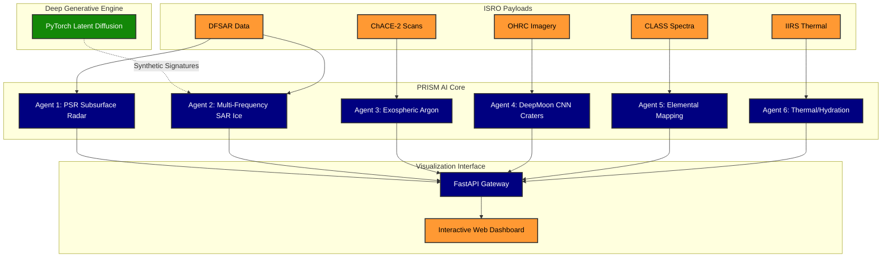

 

# 🌌 PRISM

**An intelligent, multi-agent AI framework designed to process, analyze, and visualize multi-payload data from the Chandrayaan-2 mission.**

---

## 🎯 Problem Statement (PS)

**To design and develop an intelligent, multi-agent artificial intelligence framework capable of autonomously processing, fusing, and analyzing heterogeneous datasets from Chandrayaan-2 payloads to extract actionable planetary science insights.**

---

## 🚀 Overview

**PRISM** is an advanced Generative AI and Machine Learning pipeline engineered specifically for the Indian Space Research Organisation (ISRO). It tackles the extreme data sparsity of deep-space exploration by autonomously fusing physics-based datasets and utilizing cutting-edge deep learning to map the Moon's surface and exosphere.

By ingesting raw scientific products from Chandrayaan-2's diverse payloads, PRISM's multi-agent architecture performs high-resolution crater counting, subsurface ice classification, argon distribution mapping, and elemental abundance profiling.

---

## 🛰️ Chandrayaan-2 Payloads Integrated

| Payload | Description | AI Agent Application |
| :---: | :--- | :--- |
| **DFSAR** | Dual-Frequency Synthetic Aperture Radar | Subsurface Ice & Regolith Classification |
| **OHRC** | Orbiter High-Resolution Camera | Self-Supervised Crater Detection & Topography |
| **ChACE-2** | Chandra's Atmospheric Composition Explorer | Exospheric Argon-40 Distribution |
| **CLASS** | Chandrayaan-2 Large Area Soft X-ray Spectrometer | Elemental Mapping (Mg, Al, Si, Ca, Ti, Fe) |
| **IIRS** | Imaging Infrared Spectrometer | Surface Thermal & Hydration Signatures |

---

## 🧠 Multi-Agent Architecture

PRISM relies on a distributed multi-agent system, where specialized AI models tackle discrete planetary science challenges. These agents feed into a unified backend, providing a holistic understanding of the lunar environment.

### 🌊 Generative AI Data Augmentation
To overcome the physical scarcity of labeled lunar radar data, PRISM employs a **Latent Diffusion UNet**. This neural network synthesizes physically-accurate synthetic SAR signatures based on genuine DFSAR data, enabling our classification agents to learn robust planetary boundaries without overfitting.

### 🌑 DeepMoon Crater CNN
Utilizing high-resolution **OHRC** imagery, our deep Convolutional Neural Network detects micro-craters using self-supervised morphological feature variance. This bypasses the need for manual human annotation while grounding the network entirely in genuine physical geometry.

---

## ⚙️ System Workflow

---

## 🛠️ Technology Stack

* **Machine Learning:** PyTorch, Scikit-Learn, Pandas, NumPy
* **Generative AI:** Latent Diffusion Models, Convolutional Neural Networks
* **Backend Integration:** FastAPI, Uvicorn, Python 3.11+
* **Data Processing:** Rasterio, GeoPandas, Pillow
* **Architecture:** Multi-Agent AI Framework

   
  <b>"Exploring the Moon, one pixel at a time."</b>
    
  

